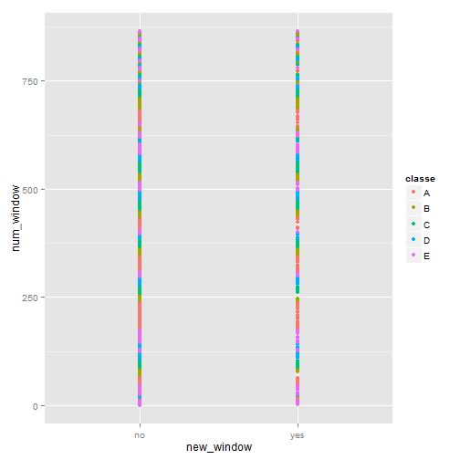
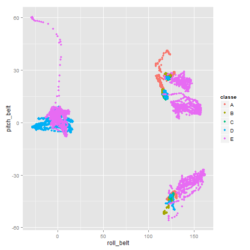
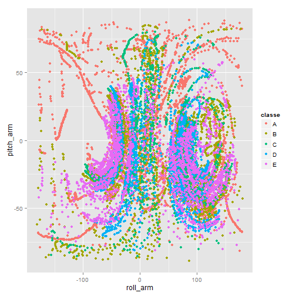
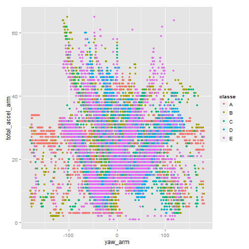

PML Course Project
========================================================

## Summary
Using devices such as Jawbone Up, Nike FuelBand, and Fitbit it is now possible to collect a large amount of data about personal activity relatively inexpensively. One thing that people regularly do is quantify how much of a particular activity they do, but they rarely quantify how well they do it. 
After analysing the variables in the data set using qplot function, we get 18 variables which can be used to predict the exercises.

We train using the random forest method and upon implimenting on the test set the error appears siginificantly low at 0.3%. We can predict the exercises using this model with a high degree of confidence.

## Analysis
The following commented lines of code were initially used to download the requisite files.

```r
#setInternet2(TRUE)  # set the R_WIN_INTERNET2 to TRUE
#download.file("https://d396qusza40orc.cloudfront.net/predmachlearn/pml-training.csv", destfile="pml-training.csv")
#download.file("https://d396qusza40orc.cloudfront.net/predmachlearn/pml-testing.csv", destfile="pml-testing.csv")
```

### Load and prepare the data. 
Create datasets for the following purposes:
* A training dataset to create the model.
* A cross validation dataset to estimate error rate as produced by our model. We will keep the ratio between training & cross-validation dataset as 8:2
* A testing data set.

```r
library(caret)
```

```
## Loading required package: lattice
## Loading required package: ggplot2
```

```r
raw_training <- read.csv("pml-training.csv")

set.seed(1)
inTrain <- createDataPartition(y=raw_training$classe,p=0.8, list=FALSE)
training <- raw_training[inTrain, ]
cv       <- raw_training[-inTrain, ]

testing  <- read.csv("pml-testing.csv")
```

### Explanatory Analysis
We start looking at the variables using explanatory analysis as can be seen by the plots below. From the projects guidelines we show only 4 of the plots.

```r
qplot(new_window, num_window, col=classe, data=training);
```

 

```r
qplot(roll_belt, pitch_belt, col=classe, data=training);
```

 

```r
qplot(roll_arm, pitch_arm, col=classe, data=training);
```

 

```r
qplot(yaw_arm, total_accel_arm, col=classe, data=training);
```

 

Using the plotting analysis as shown with the variables in examples above and with the remainder variables (not shown in here, due to project restrictions), we use the following variables as explanatory variables:


```r
variables <- "new_window + num_window + roll_belt + pitch_belt + yaw_belt + total_accel_belt + roll_arm + pitch_arm + yaw_arm + total_accel_arm + roll_dumbbell + pitch_dumbbell + yaw_dumbbell + total_accel_dumbbell + roll_forearm + pitch_forearm + yaw_forearm + total_accel_forearm";
```

### Model Creation
The following code creates the random forest model.

```r
set.seed(2);

modFit <- train( eval(parse(text=paste("classe ~", variables, sep="")))
  ,data=training, method="rf")
```

```
## Loading required package: randomForest
## randomForest 4.6-7
## Type rfNews() to see new features/changes/bug fixes.
```

## Results
After creating our model, we check the error rate for cross-validation dataset.
The error rate is approximately 0.3% in the cross-validation dataset. 

```r
# error rate
sum(predict(modFit, cv) != cv$classe)/length(cv$classe)
```

```
## Loading required package: randomForest
## randomForest 4.6-7
## Type rfNews() to see new features/changes/bug fixes.
```

```
## [1] 0.002549
```

Using our model, we predict labels in test samples.
The outputs are written in each files (total 20 files are created).

```r
# test sample
answers <- predict(modFit, testing)
pml_write_files = function(x){
  n = length(x)
  for(i in 1:n){
    filename = paste0("problem_id_",i,".txt")
    write.table(x[i],file=filename,quote=FALSE,row.names=FALSE,col.names=FALSE)
  }
}
pml_write_files(answers)
```
